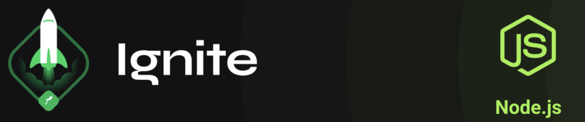

<h1 align="center">
  Ignite NodeJS | Challenges
</h1>

Collection of annotations, challenges and several content of Ignite's NodeJS trail.

---

## Summary

### Chapter I

- [Main challenge 01 - NodeJS fundamentals](https://github.com/debfdias/ignite-nodejs/tree/main/challenge1)
- [Optional challenge 1 - Using Swagger to create documentation](https://github.com/debfdias/ignite-nodejs/tree/main/challenge1.1)
- [Optional challenge 2 - Refactoring code](https://github.com/debfdias/ignite-nodejs/tree/main/challenge1.2)

### Chapter II

- [Main challenge 1 - SOLID introduction](https://github.com/debfdias/ignite-nodejs/tree/main/challenge2)
- [Optional challenge 1 - Working with middlewares](https://github.com/debfdias/ignite-nodejs/tree/main/challenge2.1)

### Chapter III

- [Main challenge 1 - Database queries](https://github.com/debfdias/ignite-nodejs/tree/main/challenge3)
- [Optional challenge 1 - Database modeling](https://github.com/debfdias/ignite-nodejs/tree/main/challenge3.1)

### Chapter IV

- [Main challenge 1 - Unit testing](https://github.com/debfdias/ignite-nodejs/tree/main/challenge_4)
- [Optional challenge 1 - Integration testing](https://github.com/debfdias/ignite-nodejs/tree/main/challenge_4.1)

### Chapter V

- [Optional challenge 1 - Transfer with FinAPI](https://github.com/debfdias/ignite-nodejs/tree/main/challenge_5.1)

### Chapter VI

- [Optional challenge 1 - Using serverless](https://github.com/debfdias/ignite-nodejs/tree/main/challenge_6.1)
